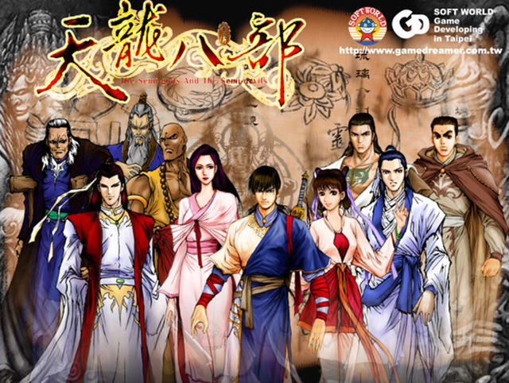

# DGSD
## the Demi-Gods and the Semi-Devils (天龙八部)
Enjoy the game, in terminal.

### What is DGSD
- A terminal RPG
- A terminal RPG maker

Text-image rendered by `curses` in python.

### Play
```
python3 main.py
```
Keys: `w`, `a`, `s`, `d`, `Esc`, `Enter`


### Make a game
This project provide the following RPG factors to config:
- mesh
- scene
- chat

next
- inventory
- attribute & battle system
- task system

#### Mesh
Refer `config_mesh.py`

A mesh is a character layout. Any item in the scene is a mesh. There're three types of mesh supported:
- `MeshType.STATIC`: a static mesh (eg. `house`)
- `MeshType.ANIMATE`: an animating mesh, the mesh will play next frame on each mesh (eg. `role`)
- `MeshType.RANDOM`: the game will randomly load one frame from the given mesh list when starts (eg, `rock`)

#### Scene
Refer `config_scene.py`

A scene is defined as the starting place of role and all other mesh items.
```
scene = {
  'rolePos': [x, y]
  'items': [...mesh_items]
}
```
Each mesh item has following attribute:
- `meshName`: defined name in MeshMap in mesh config
- `pos`: mesh position
- `zindex`: higher value ones will cover lower ones
- `colorId`(*optinal*): constant from `ColorId.YELLOW, ColorId.GREEN, ColorId.BLUE, ColorId.RED, ColorId.MAGENTA, ColorId.CYAN`
- `gridType`: constant from `MapGridType.BLOCK, MapGridType.FREE`, where `BLOCK` means the role can not step on the mesh
- `triggerType`(*optinal*): constant from `TriggerType.CHAT, TriggerType.CHANGE_SCENE`, where `CHAT` will trigger a chat when collide with the mesh (npc), and `CHANGE_SCENE` will load another scene when the role collides with the `TRIGGER_CHAR`(#) on the mesh. The attribute come along with `triggerItem`
- `triggerItem`(*optinal*): chat or scene name defined in config
- `bold`(*optinal*): show the mesh characters in bold font

#### Chat
Refer `config_chat.py`

A chat is defined as a list of chat items. Each chat item has  following attribute:
- `id`: index of the item
- `title`: text of current chat box
- `type`: constant from `ChatTextType.STATEMENT, ChatTextType.BRANCH`, where `branch` means current chat box contains a choice question, come with the attribute `branch`, `branch_to`
- `branch`: a list of choices
- `branch_to`: a list index of the corresponding choice should jump to. Should have equal length with `branch`
- `status_code`(*optional*): a status that current chat item will trigger
- `exclude_status`: status that if triggered by previous chat items, this item will not be shown anymore
- `prereq_status`: status that needed to be triggered to show this item


I create this project in memory to my favourite PC game ever.


